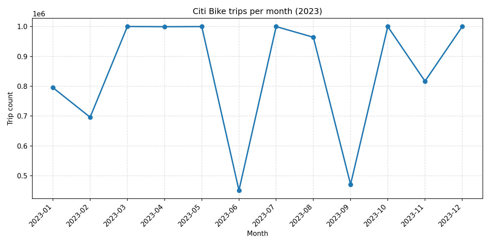
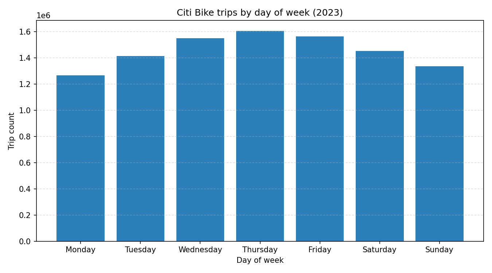
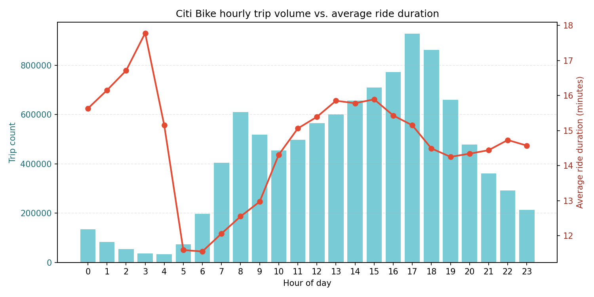
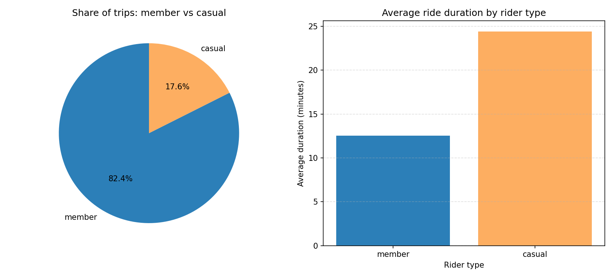
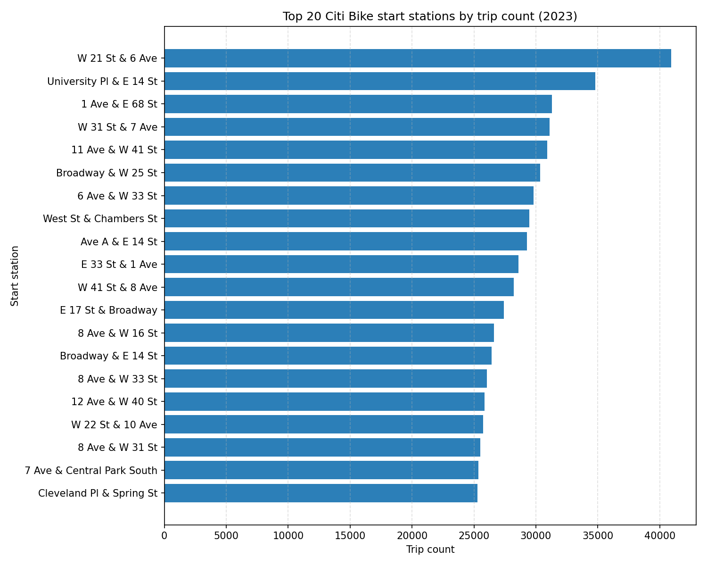
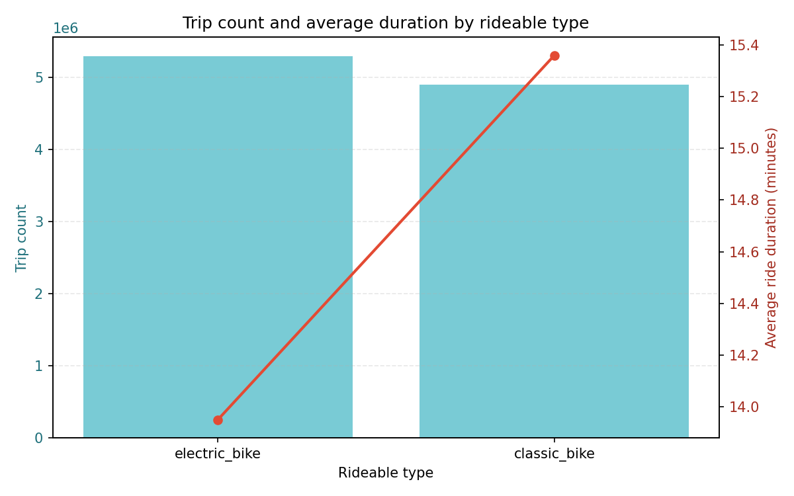

# Stage 2 EDA Report

Six insights into the 2023 Citi Bike trip dataset, drawn from the Hive table `team19_projectdb.citibike_trips_optimized`. Each insight pairs its HiveQL summary with a chart and a short business-stakeholder story.

## Insight 1: Seasonal demand: monthly trip volume

**Query:** GROUP BY ride_year, ride_month over citibike_trips_optimized; ordered chronologically.

**Story.** Winter months (January and February) show the lowest volume, consistent with cold-weather behaviour, while most other months sit close to the dataset's per-month cap of around one million rides. Two months (June and September) stand out as much lower than their neighbours, suggesting a sampling gap in the underlying monthly archives rather than a real demand drop. For operations, the cold-weather dip is the only robust signal to plan capacity around; the June and September outliers are a data-quality flag to investigate before drawing seasonal conclusions.

## Insight 2: Weekly rhythm: trips by day of week

**Query:** GROUP BY ride_weekday with weekday names; ordered Monday-Sunday.

**Story.** Weekday usage dominates volume, consistent with commuter behaviour, while weekend volumes are typically lower but skew toward longer leisure trips. Marketing campaigns and promo pricing should differentiate commuter weekdays from leisure weekends to capture the right intent at the right time.

## Insight 3: Daily rhythm: hourly volume vs. ride length

**Query:** GROUP BY ride_hour returning trip count and average duration.

**Story.** Two pronounced rush hours - morning and evening - dominate the day, while average ride duration is often longer outside those peaks (leisure trips). The combined view tells operations not just when to rebalance bikes but also that midday rebalancing must account for longer trip times pulling bikes off the grid.

## Insight 4: Customer mix: members vs casuals

**Query:** GROUP BY member_casual returning trip share and average duration.

**Story.** Members account for the majority of trips, but casual riders consistently take longer trips on average. That mix matters for revenue: members drive volume and predictability while casuals drive per-trip revenue and tourist-area utilisation, suggesting different retention strategies for each segment.

## Insight 5: Spatial demand: top 20 start stations

**Query:** GROUP BY start_station_id, start_station_name; LIMIT 20 by trip count.

**Story.** Demand is concentrated in a small number of stations, predominantly in midtown and lower Manhattan transit hubs. These hot spots should be the focus of capacity expansion, preventive maintenance, and the rebalancing fleet's first stops of every shift.

## Insight 6: Fleet mix: rideable type usage and duration

**Query:** GROUP BY rideable_type returning trip count and average duration.

**Story.** Classic and electric bikes dominate the trip mix; electric bikes typically support shorter or faster trips while classic bikes carry the bulk of volume. Future fleet investment should weigh marginal demand for e-bikes against their higher unit and maintenance cost implied by usage intensity.
